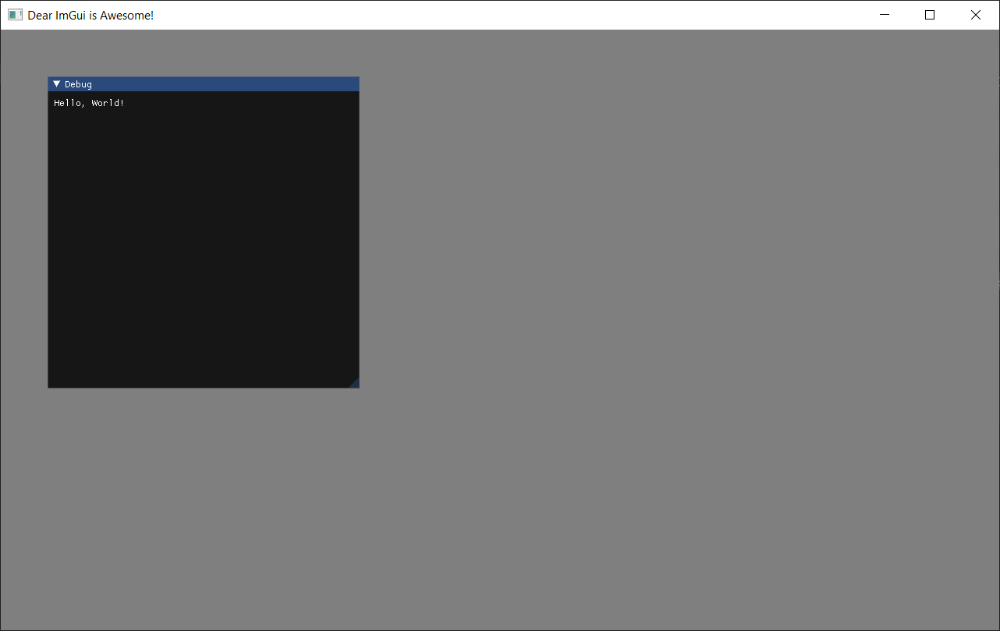

# Minimal working examples for ImGui (Windows, Java, Gradle, LWJGL, OpenGL)

* `mwe-application` is using the application layer from `imgui-app`.
* `mwe-binding` is using the bindings with custom window creation (GLFW from LWJGL).

Both Gradle projects were generated with default settings by following this [guide](https://docs.gradle.org/current/samples/sample_building_java_applications.html) in Gradle docs. Runnable `.jar`s can be created with the help of [Shadow](https://imperceptiblethoughts.com/shadow/getting-started/). Project created with [VSCode](https://code.visualstudio.com/docs/languages/java), [Extension Pack for Java](https://marketplace.visualstudio.com/items?itemName=vscjava.vscode-java-pack), [Gradle](https://gradle.org/install/) and [Gradle for Java extension](https://marketplace.visualstudio.com/items?itemName=vscjava.vscode-gradle).

MWEs were created with the help of these resources:

* ["imgui-java" by "SpaiR"](https://github.com/SpaiR/imgui-java)
* ["example" in "imgui-java"](https://github.com/SpaiR/imgui-java/blob/6b836aa2f94b4d5c276bb986acfc37447fe7c81e/example/src/main/java/Main.java)
* ["IntegratingImGui" by "codingminecraft"](https://github.com/codingminecraft/IntegratingImGui)
* ["ImGui in LWJGL (UPDATE) | LWJGL Series #3" by "GamesWithGabe"](https://www.youtube.com/watch?v=Xq-eVcNtUbw)
* ["3D Game Engine - Window Setup #2 LWJGL / OpenGL Tutorial" by "DevGenie Academy"](https://www.youtube.com/watch?v=a4Xwp2ln-N0&list=PL4QbKfRYvHvSJSVgHawYIvcIA0CcgnMzw&index=2)
* ["ImGui" in "libGDX"](https://libgdx.com/wiki/graphics/2d/imgui)

Screenshot:

